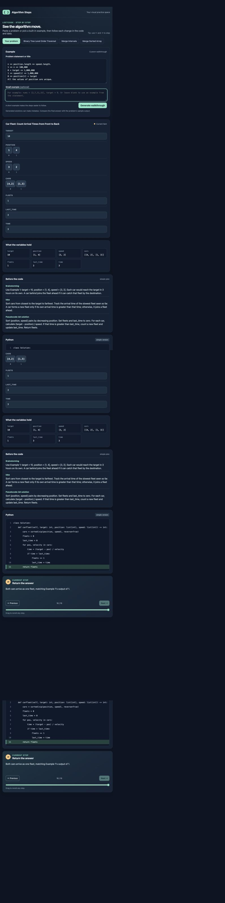

# Algorithm Steps

A personal visual algorithm tutor for learning how an idea becomes Python code. Follow a solution one step at a time, watch its variables change, and see the active line highlighted.



## Features

- Three built-in examples: Binary Tree Level Order Traversal, Merge Intervals, and Merge Sorted Array.
- Custom problem tutor: paste a problem and an optional small example to generate a plan, Python solution, and step-by-step trace.
- Previous/Next controls, a step slider, and left/right keyboard navigation.
- Variable snapshots and visual displays for arrays and other data.
- Private hosting with the API key stored only as a server-side secret.

## How it works

The interface uses plain HTML, CSS, and JavaScript. Built-in examples and step navigation run locally in the browser. Generating a custom walkthrough sends one request to a Cloudflare Workers-compatible backend, which calls the OpenAI Responses API with a structured JSON schema.

The current tutor uses `gpt-6-sol`, low reasoning effort, and a 7,800-token output limit. Each generation can incur API charges; navigation and built-in examples do not. There are no automatic API retries and no monthly spending cap enforced by this code. Configure spending controls in the API project separately. Generated solutions can contain mistakes; compare results against the problem examples.

## Run the built-in examples locally

From the repository directory:

```sh
python3 -m http.server 8000 --directory dist
```

Open <http://localhost:8000>. This static preview supports the built-in examples. Custom generation requires the backend and its authenticated hosting environment; the static preview does not serve `/api/walkthrough`.

## Build the hosted Worker

Requires Node.js 20.11 or newer. No npm dependencies are required.

```sh
npm run build
```

The build embeds the HTML, CSS, and browser JavaScript into `dist/server/index.js` and copies the hosting manifest into `dist/.openai/hosting.json`.

The existing private deployment uses Sites. Its manifest is `.openai/hosting.json`. The backend expects an authenticated user header supplied by the trusted hosting layer and an `OPENAI_API_KEY` runtime secret. Configure the secret through the hosting provider; never put it in browser code, the hosting manifest, or a commit. A local `.env` file is not loaded automatically by the build or static preview.

Pushing this repository to GitHub does not redeploy the Site. GitHub Pages alone cannot run the custom tutor backend. If adapting to another host, implement trusted authentication before exposing the endpoint; do not trust a client-supplied user header.

## Project layout

```text
dist/index.html       Page structure
dist/styles.css       Interface styles
dist/app.js           Built-in traces and interactive tutor
worker/handler.js     Authenticated custom-walkthrough endpoint
scripts/build.mjs     Worker asset bundler
.openai/hosting.json  Existing Sites project association
docs/screenshot.png   Verified Car Fleet walkthrough
```

The editable frontend lives in `dist/`; `dist/server/` and `dist/.openai/` are generated and ignored. `.env.example` documents the secret name without containing a key.
